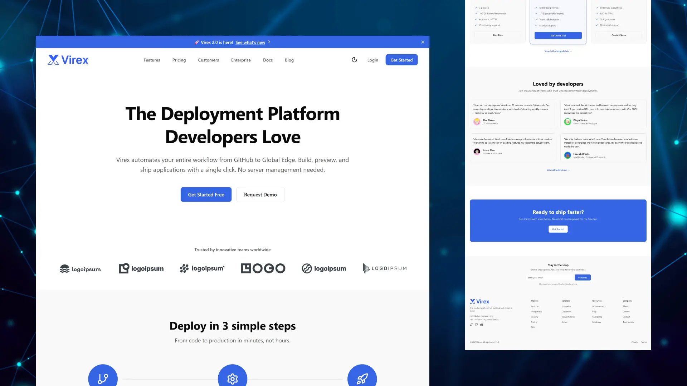
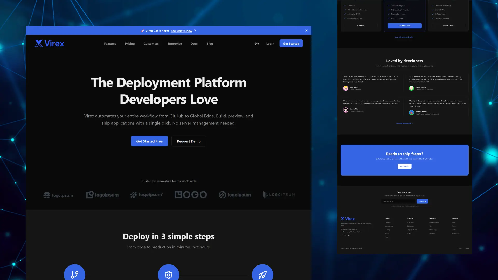

# Virex - SaaS UI Theme for Astro

[](https://astro.build)
[](https://opensource.org/licenses/MIT)

A production-ready SaaS theme for Astro. Designed to help you move from idea to launch quickly, Virex includes marketing pages, documentation, and a dashboard UI. Built with a strong focus on performance, simplicity, and easy customization.

## Why Virex?

Unlike many Astro themes that focus only on marketing pages, Virex also includes a production-ready dashboard UI. You get more than landing pages, but a structured dashboard layout with reusable components and example pages for common SaaS workflows.

This allows you to move faster—from an initial landing page to an MVP dashboard UI—while keeping a consistent design system, theming, and code quality across your entire project.

## Demo

<div align="center">

[](https://virex.erland.me)

<table>
  <tr>
    <td width="50%">
      
      <p align="center"><em>Light Mode</em></p>
    </td>
    <td width="50%">
      
      <p align="center"><em>Dark Mode</em></p>
    </td>
  </tr>
</table>

</div>

## Features

### Performance & Developer Experience

Modern tech stack with **Astro**, **TypeScript**, and **Tailwind CSS v4**.

- Path aliases (`@dashboard/*`, `@ui/*`, etc.) for cleaner imports
- ESLint and Prettier configured for code quality
- Design tokens with OKLCH color system for easy theming
- Dark mode support with localStorage persistence
- 200,000+ icons via astro-icon (Lucide + Simple Icons)

### Marketing & Conversion

A complete set of landing pages optimized for SaaS marketing.

- Hero sections, feature grids, pricing tables, testimonials
- Contact forms with validation and multiple backend support
- Team pages, case studies, integrations showcases
- SEO-optimized with meta tags, Open Graph, and JSON-LD
- Accessible with WCAG compliance and semantic HTML
- Legal pages (privacy policy, terms of service)

### Dashboard UI

Flexible dashboard layout with sidebar navigation and reusable components.

- **Components**: StatCard, DataTable, Chart, Modal, Toast, and more
- **Example Pages**: Overview, Settings (Profile, Team, Billing), Projects
- **Routes**: `/dashboard`, `/dashboard/settings/*`, `/dashboard/projects`
- Full light/dark mode support with consistent theming

**Important**: Dashboard pages use starter templates with sample data. Authentication is intentionally left to the user. See [Dashboard docs](./docs/07-dashboard.md) for guidance.

### Content Management

Built-in content collections with full Markdown and MDX support.

- **Blog**: Paginated posts with tag filtering and reading time
- **Documentation**: Auto-generated sidebar with section grouping
- **Changelog**: Version history with release timeline
- **Testimonials**: Customer quotes with featured/ordering support

## Quick Start

### 1. Create a new project

```bash
npm create astro@latest -- --template erlandv/virex
```

### 2. Start development

```bash
cd your-project-name
npm run dev
```

Your site is now running at [http://localhost:4321](http://localhost:4321)

## What's Next?

Once your project is running, here's what you should do:

1. **Configure Your Site** - Update site metadata in `src/config/site.ts`
2. **Customize Design** - Edit design tokens in `src/styles/global.css`
3. **Add Content** - Create blog posts, docs, and changelog entries
4. **Build Dashboard** - Implement authentication and connect your API

## Documentation

Full documentation is available in the [`docs/`](./docs/) folder:

1. **[Getting Started](./docs/01-getting-started.md)** - Installation and project structure
2. **[Configuration](./docs/02-configuration.md)** - Site settings and feature flags
3. **[Customization](./docs/03-customization.md)** - Design tokens, branding, and theming
4. **[Content Guide](./docs/04-content-guide.md)** - Managing blog, docs, changelog, and testimonials
5. **[Components](./docs/05-components.md)** - Icons, forms, and UI components
6. **[Pages](./docs/06-pages.md)** - Available pages and routing
7. **[Dashboard](./docs/07-dashboard.md)** - Dashboard layouts and components
8. **[Authentication](./docs/08-authentication.md)** - Authentication guidance
9. **[Deployment](./docs/09-deployment.md)** - Deploying to Vercel, Netlify, or Cloudflare

## License

Virex Theme is free for personal and commercial use under the [MIT License](./LICENSE). Attribution is not required, but a link back to this repository is always appreciated.
